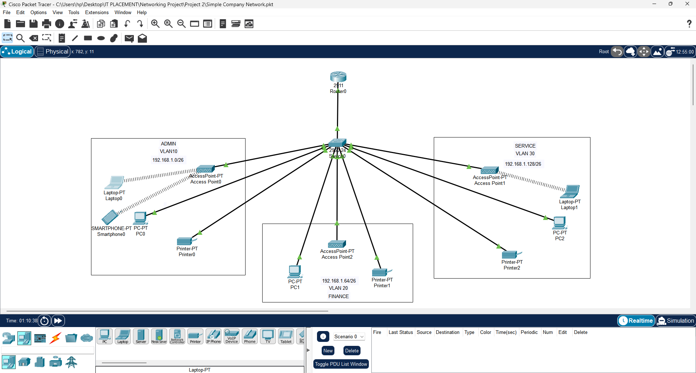

# Inter-VLAN Routing with Router-on-a-Stick

## 📌 Description
This project demonstrates the design and configuration of a segmented network using VLANs and Router-on-a-Stick inter-VLAN routing.

A base network of 192.168.1.0/24 is subnetted into /26 networks to support three VLANs (Admin, Finance, and Service). A router is configured with subinterfaces using IEEE 802.1Q encapsulation to enable communication between VLANs, while a switch is used to assign VLANs and provide trunking.

## 🖥️ Network Topology

## 🌐 IP Addressing Scheme

| VLAN | Name    | Network            | Gateway        |
|------|--------|--------------------|----------------|
| 10   | Admin   | 192.168.1.0/26     | 192.168.1.1    |
| 20   | Finance | 192.168.1.64/26    | 192.168.1.65   |
| 30   | Service | 192.168.1.128/26   | 192.168.1.129  |

## ⚙️ Features
- VLAN segmentation (VLAN 10, 20, 30)
- Router-on-a-Stick configuration
- Inter-VLAN routing
- DHCP configuration for automatic IP assignment
- Trunk link between router and switch

## 🛠️ Tools & Technologies
- Cisco Packet Tracer
- Networking concepts (VLANs, Subnetting, Routing)

## 📂 Configuration Files
- Router configuration: `configs/R1_config.txt`
- Switch configuration: `configs/S1_config.txt`

## ▶️ How to Run
1. Open the `.pkt` file in Cisco Packet Tracer
2. Power on all devices
3. Verify IP assignment using DHCP
4. Test connectivity using ping between VLANs

## ✅ Testing
- Devices in different VLANs can successfully ping each other
- DHCP assigns correct IP addresses per VLAN

## 🔒 Future Improvements
- Implement port security
- Add ACLs for traffic control
- Introduce network monitoring

## 👤 Author
Akintomowo Fiyinfoluwa
Computer Engineering Student  
