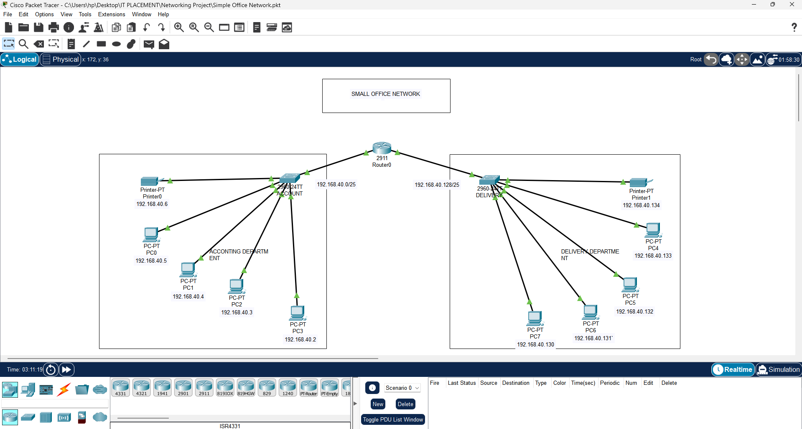

# Basic Routing Between Two Subnets

## 📌 Description
This project demonstrates the design and configuration of a segmented network using Basic (or Direct) Routing Between Two Subnets

A base network of 192.168.40.0/25. A router is configured with basic routing to enable communication between two seperate LANs

## 🖥️ Network Topology

## 🌐 IP Addressing Scheme

| Name     | Network            | Gateway           |
|--------- |--------------------|-------------------|
| Printer0 | 192.168.40.6/25    | 192.168.40.1      |
| PC0      | 192.168.40.5/25    | 192.168.40.1      |
| PC1      | 192.168.40.4/25    | 192.168.40.1      |
| PC2      | 192.168.40.3/25    | 192.168.40.1      |
| PC03     | 192.168.40.2/25    | 192.168.40.1      |
| Printer1 | 192.168.40.134/25  | 192.168.40.129    |
| PC4      | 192.168.40.133/25  | 192.168.40.129    |
| PC5      | 192.168.40.132/25  | 192.168.40.129    |
| PC6      | 192.168.40.131/25  | 192.168.40.129    |
| PC7      | 192.168.40.130/25  | 192.168.40.129    |

## ⚙️ Features
- Basic (or Direct) Routing Between Two Subnets

## 🛠️ Tools & Technologies
- Cisco Packet Tracer
- Networking concepts (Subnetting, Routing)

## 📂 Configuration Files
- Configuration: `configs.txt`

## ▶️ How to Run
1. Open the `.pkt` file in Cisco Packet Tracer
2. Power on all devices
4. Test connectivity using ping between VLANs

## ✅ Testing
- Devices in different subnets can successfully ping each other
- manually assigns correct IP addresses for devices

## 👤 Author
Akintomowo Fiyinfoluwa
Computer Engineering Student  
